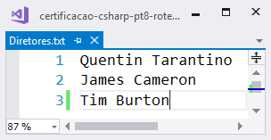

# Certificação C# Programming parte 8: Entrada e Saída de Dados

### Executar operações de E/S

### Introdução ao Curso

Neste capítulo, vamos estudar
operações de entrada/saída (E/S) fundamentais
que permitem armazenamento de dados através de em aplicativos.
Você vai descobrir como os arquivos são
gerenciados pelo sistema operacional e por bibliotecas .NET
que permitem aos programas armazenar e carregar dados.

Quando comparamos com a velocidade dos processadores modernos, 
percebemos que o acesso a arquivos é uma atividade muito lenta, então também vamos
utilizar o uso de E/S assíncrono, que pode ser usado para manter um 
aplicativo "responsivo" mesmo quando ele está lendo ou escrevendo uma grande
quantidades de dados.

Então vamos aprender a:

- ler e gravar arquivos e fluxos
- ler e gravar a partir da rede usando
classes do namespace `System.Net`
- Implementar operações de E/S assíncronas

### Ler e gravar arquivos e fluxos

Vamos praticar a leitura de um arquivo preexistente, chamado **Diretores.txt**,
coletando alguns dos seus bytes e exibindo o conteúdo na tela.



Para isso, declaramos a variável `fluxoArquivo` como uma instância da class `FileStream`:

```csharp
FileStream fluxoArquivo;
```

A classe `FileStream` define um *fluxo de dados* para um arquivo. Esse arquivo
reside no disco, no mesmo local onde está o executável da nossa aplicação.

Como queremos *abrir* o arquivo para *leitura*, passamos os
parâmetros FileMode.Open, FileAccess.Read como argumentos do construtor.

```csharp
FileStream fluxoArquivo = 
    new FileStream("Diretores.txt", FileMode.Open, FileAccess.Read);
```

Então agora temos o objeto `fluxoArquivo` pronto para ler o arquivo.

Mas para isso, o método `Read()` exige que você informe:

- Em que array de destino quer gravar os dados lidos?
- A partir de qua posição vai começar a ler?
- Quantos bytes quer ler?


```csharp
fluxoArquivo.Read(bytes, posicao, tamanho);
```

Vamos preparar algumas variáveis antes da leitura:

```csharp
byte[] bytes = new byte[10];
int posicao = 0;
int tamanho = 10;
fluxoArquivo.Read(bytes, posicao, tamanho);
```

Agora sim, executando o código, teremos os dados gravados no array `bytes`.


Mas esses números não significam muito para nós. Vamos convertê-los
para caracteres, utilizando um laço `foreach` e uma conversão para o tipo `char`.

```csharp
byte[] bytes = new byte[10];
int posicao = 0;
int tamanho = 10;
fluxoArquivo.Read(bytes, posicao, tamanho);

foreach (var caractere in bytes)
{
    Console.Write((char)caractere);
}
```

Rodando o programa, temos:


No exemplo acima, trabalhamos com um exemplo de **fluxo**.

Um **fluxo** é um objeto que representa um *fluxo
de dados*. O framework .NET contém uma classe `Stream`,
que serve como o tipo-base para uma variedade de classes
(tais como `FileStream`) que podem ser usadas para ler e gravar dados. Existem
três maneiras que um programa pode interagir com um fluxo:

* gravar uma seqüência de bytes para um fluxo
* Ler uma sequência de bytes de um fluxo
* Posicionar o "ponteiro de arquivo" em um fluxo

Para demonstrar um exemplo de "fluxo", vamos imaginar uma antiga fita cassete. 


O *ponteiro do arquivo* é a posição em um fluxo onde
a próxima operação de leitura ou gravação ocorrerá.


Um programa pode usar o método `Seek` fornecido pelo
fluxo para definir esta posição. 

Vamos demonstrar isso modificando nosso programa para "pular" para
uma posição específica (ponteiro de arquivo) antes de ler os 10 bytes do arquivo:

```csharp
byte[] bytes = new byte[10];
int posicao = 0;
int tamanho = 10;
fluxoArquivo.Read(bytes, posicao, tamanho);

//demonstrando o comando Seek
fluxoArquivo.Seek(5, SeekOrigin.Current);
fluxoArquivo.Read(bytes, posicao, tamanho);
```

Como resultado, agora temos:


A classe `Stream` é abstrata e serve como
modelo para fluxos que se conectam ao armazenamento real
Recursos.


### FIGURA 1 Alguns dos tipos de fluxo


Todas as classes filhas contêm os comportamentos do fluxo
que permitem a transferência de dados.

Por exemplo, o método de fluxo `Write` pode ser usado em qualquer um deles para
escrever bytes para esse fluxo. No entanto, a sua criação varia conforme o tipo do
fluxo. Por exemplo, para criar um `FileStream`, um programa deve
especificar o caminho para o arquivo e como o arquivo vai
ser usado. Para criar um `MemoryStream`, um programa deve
especificar o buffer na memória a ser usado.

### Usando o FileStream

O objeto `FileStream` fornece uma instância de fluxo
correspondente a um arquivo. A instância do objeto de fluxo
converte chamadas no fluxo em comandos para o
sistema de arquivos no computador que executa o programa:

```csharp
FileStream fluxoArquivo = 
    new FileStream("Diretores.txt", FileMode.Open, FileAccess.Read);
```

O sistema de arquivos fornece a interface para o dispositivo físico
que realiza o armazenamento de dados para o computador.

A Figura 2 mostra como isso funciona. Uma chamada do método de gravação
em um objeto de fluxo irá gerar uma requisição para o
sistema de arquivos para gravar os dados no dispositivo de armazenamento.

                                                                                    
```csharp
+-----------+     +--------+                                                        
| Aplicação |     | Stream |      +-------------+      +-------------+              
|    C#     |<--->| Object |<---->| FileStream  |<---->| Dispositivo |              
+-----------+     +--------+      +-------------+      +-------------+
```

### FIGURA 2 O objeto Stream

A Listagem 1 mostra como um programa pode usar um
`FileStream` para criar um fluxo de saída conectado a um
arquivo novo ou preexistente.

### Listagem 1 Usando um FileStream


```csharp
using System;
using System.IO;
using System.Text;

namespace Listings
{
    class Listing4_01 //Using a FileStream
    {
        static void XMain(string[] args)
        {
            // Gravando no arquivo

            FileStream fluxoSaida = new FileStream("ArquivoSaida.txt",
                FileMode.OpenOrCreate, FileAccess.Write);
            string mensagemSaida = "Olá, Alura!";

            var bytesMensagemSaida = Encoding.UTF8.GetBytes(mensagemSaida);
            fluxoSaida.Write(bytesMensagemSaida, 0, bytesMensagemSaida.Length);
            fluxoSaida.Close();
            FileStream fluxoEntrada = new FileStream("ArquivoSaida.txt", FileMode.Open, FileAccess.Read);

            long tamanhoArquivo = fluxoEntrada.Length;
            var bytesLidos = new byte[tamanhoArquivo];
            fluxoEntrada.Read(bytesLidos, 0, (int)tamanhoArquivo);
            string texto = Encoding.UTF8.GetString(bytesLidos);
            fluxoEntrada.Close();
            Console.WriteLine("Mensagem lida: {0}", texto);

            Console.ReadKey();
        }
    }
}
```

Note que o programa escreve um bloco de byes
para esse fluxo. Em seguida, cria um novo fluxo que é usado
para ler os bytes do arquivo. Os bytes a serem escritos
são obtidos pela codificação de uma string de texto (com o método `Encoding.UTF8.GetString`).

### Controlando Acesso ao Arquivo com o FileMode e o FileAccess

Um fluxo pode ser associado à leitura, gravação ou atualização de um
Arquivo. A classe-base `Stream` fornece propriedades que um programa
pode usar para determinar as habilidades de uma determinada instância de fluxo
(Isto é, se um programa pode ler, escrever ou procurar neste fluxo).

A enumeração `FileMode` é usada no construtor de um
`FileStream` para indicar como o arquivo deve ser aberto.

Os seguintes modos estão disponíveis:

* `FileMode.Append` Abre um arquivo para anexar dados ao final.
Se o arquivo existir, mova a posição de busca até o final deste
Arquivo. Se o arquivo não existir, ele será criado. Este modo só pode
ser usado se o arquivo estiver sendo aberto para gravação.
* `FileMode.Create` Cria um arquivo para escrever. Se o arquivo
já existe, ele é sobrescrito. Note que isso significa que o
o conteúdo existente do arquivo é perdido.
* `FileMode.CreateNew` Cria um arquivo para escrita. Se o arquivo
já existe, uma exceção é lançada.
* FileMode.Open Abre um arquivo existente. Uma exceção é
lançada se o arquivo não existir. Este modo pode ser usado para
ler ou escrever.
* `FileMode.OpenOrCreate` Abre um arquivo para leitura ou
mite. Se o arquivo não existir, um arquivo vazio será criado.
Este modo pode ser usado para leitura ou escrita.
* `FileMode.Truncate` Abre um arquivo para gravar e remover
qualquer conteúdo existente.

A enumeração do `FileAccess` é usada para indicar como o arquivo
deve ser usado. Os seguintes tipos de acesso estão disponíveis:
* `FileAccess.Read` Abre um arquivo para leitura.
* `FileAccess.ReadWrite` Abre um arquivo para leitura ou escrita.
* `FileAccess.Write` Abre um arquivo para escrever.

Você pode ver estes usados na Listagem 4—1. Se um fluxo de arquivos for usado em
uma maneira que é incompatível como seu modo de abertura, a ação
provocará uma exceção.

### Converter texto em dados binários com Unicode

Um fluxo só pode transferir array de bytes de e para o
dispositivo de armazenamento, de modo que o programa na Listagem 1 usa a 
classe `Encoding` do namespace `System.Text`. A propriedade `UTF8` desta 
classe fornece métodos que codificam e decodificam o texto Unicode. 

**Unicode** é um mapeamento de símbolos de caracteres para valores numéricos.
A codificação UTF8 mapeia caracteres Unicode em valores de 8 bits
que pode ser armazenado em matrizes de bytes. A maioria dos arquivos de texto são codificados
usando UTF8. A classe `Encoding` também fornece suporte para outras
padrões de codificação, incluindo UTF32 (codificação Unicode para 32-
valores de bit) e ASCII.

O método de codificação `GetBytes` usa uma string C# e
retorna os bytes que representam essa cadeia na codificação especificada.
O método de decodificação `GetString` recebe um array de
bytes e retorna a string com um buffer contendo bytes.

### Objetos `IDispose` e `FileStream`

A classe `Stream` implementa a interface `IDisposable`.
Isso significa que qualquer objeto derivado do
O tipo `Stream` também deve implementar a interface. Isso significa que
podemos usar a instrução `using` para garantir que os arquivos sejam
devidamente fechados quando eles não forem mais necessários.

A listagem abaixo mostra como isso funciona.

### Listagem 2 FileStream e IDisposable

```csharp
using (FileStream fluxoSaida = new FileStream("ArquivoSaida.txt", FileMode.OpenOrCreate, FileAccess.Write))
{
	string mensagemSaida = "Olá, Alura!";
	byte[] bytesMensagemSaida = Encoding.UTF8.GetBytes(mensagemSaida);
	fluxoSaida.Write(bytesMensagemSaida, 0, bytesMensagemSaida.Length);
}
```

### Trabalhando com arquivos de texto

O sistema de arquivos não faz distinção particular entre arquivos de texto
e arquivos binários. Nós já vimos como podemos usar a classe `Encoding`
para converter texto Unicode em uma matriz de bytes
que pode ser transformada em um arquivo binário. No entanto, a linguagem C#
possui classes de stream que facilitam muito o trabalho com
texto. As classes `TextWriter` e `TextReader` são classes abstratas
que definem um conjunto de métodos que podem ser usados com texto.

A classe `StreamWriter` estende a classe `TextWriter` para
fornecer uma classe que podemos usar para escrever texto em fluxos.

A próxima listagem mostra como as classes `StreamWriter` e `StreamReader`
podem ser usadas no trabalho com arquivos de texto. O código realiza a mesma tarefa que o
programa na Listagem 1, mas é muito mais compacto.

### LISTING 4-3 StreamWriter and StreamReader

```csharp
using (StreamWriter fluxoGravacao = new StreamWriter("ArquivoSaida.txt"))
{
	fluxoGravacao.Write("Olá, Alura!");
}

using (StreamReader fluxoLeitura = new StreamReader("ArquivoSaida.txt"))
{
	string texto = fluxoLeitura.ReadToEnd();
	Console.WriteLine("Texto lido: {0}", texto);
}
```			


### Fluxos Encadeados

A classe Stream tem um construtor que aceita outro
stream como parâmetro, permitindo a criação de cadeias de
fluxos. A Listagem 4 mostra como usar o **GZipStream** do
namespace `Sistema.IO.Compression` em uma cadeia de fluxos
que fará a gravação e carregará o texto compactado.

### Listagem 4 Armazenando arquivos compactados

```csharp
using (FileStream fluxoArquivo = new FileStream("Texto.zip", FileMode.OpenOrCreate,
	FileAccess.Write))
{
	using (GZipStream fluxoZip = new GZipStream(fluxoArquivo, CompressionMode.Compress))
	{
		using (StreamWriter gravadorFluxo = new StreamWriter(fluxoZip))
		{
			gravadorFluxo.Write("Olá, Alura!");
		}
	}
}

using (FileStream fluxoArquivo = new FileStream("Texto.zip", FileMode.Open, FileAccess.Read))
{
	using (GZipStream fluxoZip = new GZipStream(fluxoArquivo, CompressionMode.Decompress))
	{
		using (StreamReader leitorFluxo = new StreamReader(fluxoZip))
		{
			string mensagem = leitorFluxo.ReadToEnd();
			Console.WriteLine("Texto lido: {0}", mensagem);
		}
	}
}
```

### Usando a classe File

A classe `File` é uma classe "auxiliar" que facilita o trabalho
com arquivos. Ele contém um conjunto de métodos estáticos que podem ser usados para
adicionar texto ao final de um arquivo, copiar um arquivo, criar um arquivo, excluir um arquivo, mover
arquivo, abrir um arquivo, ler um arquivo e gerenciar a segurança do arquivo. Listagem 5
mostra alguns dos recursos da classe `File` em ação.

### Listagem 5 A classe File

```csharp
File.WriteAllText(path: "Arquivo.txt", contents: "Conteúdo inicial do arquivo");
File.AppendAllText(path: "Arquivo.txt", contents: "- conteúdo adicionado depois");

if (File.Exists("Arquivo.txt"))
	Console.WriteLine("Arquivo já existe");

string conteudo = File.ReadAllText(path: "Arquivo.txt");

Console.WriteLine("Conteúdo do arquivo: {0}", conteudo);
File.Copy(sourceFileName: "Arquivo.txt", destFileName: "CopiaArquivo.txt");

using (TextReader leitor = File.OpenText(path: "CopiaArquivo.txt"))
{
	string texto = leitor.ReadToEnd();
	Console.WriteLine("Texto copiado: {0}", texto);
}
```

### Lidar com exceções de fluxo

Exceções são situações em que não faz sentido continuar com a execução de uma thread. 
Uma thread pode levantar um exceção e passar o controle para um manipulador de exceção, 
que tentará resolver a situação de uma maneira adequada, como vimos anteriormente
neste curso.

Ao criar aplicativos que usam fluxos, você precisa garantir que seu código
consegue tratar quaisquer exceções que possam ser lançadas pelo fluxo.

Isso pode acontecer a qualquer momento durante o uso de um fluxo.
Nosso aplicativo pode tentar abrir um arquivo que não existe, ou um dado
dispositivo de armazenamento pode ficar cheio durante a gravação.

Também é possível que os threads em um aplicativo multi-threaded acabem "brigando"
por arquivos. Se um thread tentar acessar um arquivo já em uso por
outro, isso também provocará exceções.

Pensando nisso, você precisa garantir que o código de produção
que abre e interage com fluxos está protegido com instruções `try-catch`.

Há um conjunto de exceções de arquivos que são usados para indicar diferentes 
condições de erro. A Listagem 6 mostra como um programa pode detectar 
um `FileNotFoundException` e responder a isso de uma maneira diferente 
de outras exceções de arquivo.

### Listagem 6 Exceções de Fluxo

```csharp
try
{
	string conteudo = File.ReadAllText(path: "Arquivo.txt");
	Console.WriteLine(conteudo);
}
catch (FileNotFoundException ex)
{
	// Arquivo não encontrado
	Console.WriteLine(ex.Message);
}
catch (Exception ex)
{
	// Outras exceções
	Console.WriteLine(ex.Message);
}
```

### Armazenamento de arquivos

Em geral, dispositivos de armazenamento, tais como uma unidade de disco ou USB portátil,
podem ser divididos em partições. Cada partição representa um
área no dispositivo de armazenamento que pode ser usado para armazenar dados.

Uma partição num dispositivo de armazenamento é exposta como uma unidade que, no
sistema operacional Windows, é representada por uma letra de unidade. 
A letra da unidade é atribuída pelo sistema operacional e é usada como
raiz de um caminho absoluto para um arquivo no computador.

O aplicativo **Disk Management** permite que os administradores
atribuam letras de unidade, (combinando várias unidades físicas em uma única
unidade lógica) anexem discos rígidos virtuais (VHD) criados a partir de
imagens da unidade. A Figura 3 abaixo mostra este programa em uso.


### FIGURA 3 O programa de gerenciamento de disco

Cada uma das partições em um dispositivo de armazenamento físico é formatada
usando um sistema de arquivamento específico que gerencia o armazenamento de arquivos.
O programa na Listagem 7 mostra como o
`DriveInfo` classe no namespace `System.IO` pode ser usado para
obter informações sobre as unidades conectadas a um sistema.

### LISTING 4-7 Drive information

```csharp
DriveInfo[] drives = DriveInfo.GetDrives();
foreach (DriveInfo drive in drives)
{
	Console.WriteLine("Nome:{0} ", drive.Name);
	if (drive.IsReady)
	{
		Console.WriteLine(" Tipo:{0}", drive.DriveType);
		Console.WriteLine(" Formato:{0}", drive.DriveFormat);
		Console.WriteLine(" Espaço livre:{0}", drive.TotalFreeSpace);
	}
	else
	{
		Console.Write(" Drive não está pronto");

	}
	Console.WriteLine();
}
```

Ao rodar o programa, ele produz a seguinte saída:

```csharp
Nome:C:\
 Tipo:Fixed
 Formato:NTFS
 Espaço livre:15034667008

Nome:D:\
 Drive não está pronto
Pressione qualquer tecla para continuar. . .
```

Observe que as unidades que são mostradas como não prontas atualmente não possuem 
dispositivos fisicamente conectado.

Um sistema de arquivos mantém informações sobre cada arquivo armazenado.
Este inclui o nome do arquivo, permissões associadas com o
arquivo, datas associadas à criação, modificação do arquivo,
e a localização física do arquivo no dispositivo de armazenamento. 
O sistema de arquivos também mantém informações de atributos sobre cada arquivo.

As informações do atributo são mantidas como um único valor Com diferentes
bits no valor indicando atributos diferentes. Podemos usar
operadores lógicos para trabalhar com esses valores e atribuir diferentes
atributos para um arquivo. Os atributos disponíveis são os seguintes:

- `FileAttributes.Archive` O arquivo não foi submetido a backup
ainda. O atributo será limpo quando / se o arquivo for submetido a backup
acima.
- `FileAttributes.Compressed` O arquivo está compactado. este
não é algo que nosso programa deve mudar.
- `FileAttributes.Directory` O arquivo é um diretório. Isso não é
algo que nosso programa deve mudar.
- `FileAttributes.Hidden` O arquivo não aparecerá em um
listagem de diretório comum.
- `FileAttributes.Normal` Este é um arquivo normal sem
atributos especiais. Este atributo só é válido quando houver
não há outros atributos atribuídos ao arquivo.
- `FileAttributes.ReadOnly` O arquivo não pode ser protegido.
- `FileAttributes.System` O arquivo faz parte do sistema operacional
sistema e é usado por ele.
- `FileAttributes.Temporary` O arquivo é um arquivo temporal
Isso não será necessário quando o aplicativo for concluído.

O sistema de arquivos tentará manter este arquivo na memória para
melhorar o desempenho.

Esta informação está exposta aos programas C# através da
classe `FileInfo`. A Listagem 4—8 mostra como um programa pode obter
as informações de informações do arquivo sobre um arquivo e, em seguida, 
trabalhar com o informações de atributo. O programa cria um novo arquivo e 
depois obtém o objeto `FileInfo` que representa o arquivo. Ele usa a
propriedade `Attributes` do objeto `FileInfo` para fazer o arquivo
`readOnly` e, em seguida, remove o atributo `readOnly`.

### Listagem 8 Usando o FileInfo

```csharp
string filePath = "Arquivo.txt";
File.WriteAllText(path: filePath, contents: "Texto inicial do arquivo");
FileInfo info = new FileInfo(filePath);
Console.WriteLine("Nome {0}", info.Name);
Console.WriteLine("Caminho completo: {0}", info.FullName);
Console.WriteLine("Último acesso: {0}", info.LastAccessTime);
Console.WriteLine("Tamanho: {0}", info.Length);
Console.WriteLine("Atributos: {0}", info.Attributes);
Console.WriteLine("Tornar o arquivo somente-leitura");
info.Attributes |= FileAttributes.ReadOnly;
Console.WriteLine("Atributos: {0}", info.Attributes);
Console.WriteLine("Remover o arquivo somente-leitura");
info.Attributes &= ~FileAttributes.ReadOnly;
Console.WriteLine("Atributos: {0}", info.Attributes);
```

Você pode usar uma instância do `FileInfo` para abrir um arquivo para leitura
e armar, mover um arquivo, renomear um arquivo e também modificar
as configurações de segurança em um arquivo. Algumas das funções fornecidas por
uma instância `FileInfo` duplica as fornecidas pelo Arquivo
classe. A classe File é mais útil quando você deseja executar
uma ação em um único arquivo.

A classe `FileInfo` é mais útil quando você quer trabalhar com um grande 
número de arquivos. Na próxima seção você vai descobrir como obter uma coleção de `FileInfo`
itens de um diretório e trabalhar com eles.

### Utilizando as classes Directory e DirectoryInfo

Um sistema de arquivos pode criar arquivos que contenham coleções de itens de 
informação de arquivos. Estes são chamados diretórios ou pastas.
Diretórios podem conter informações de diretório sobre diretórios,
que permite ao usuário encaixar diretórios para criar estruturas de árvore.

Como com arquivos, existem duas maneiras de trabalhar com diretórios:
a alasse `Directory` e a classe `DirectoryInfo`. 
A classe de diretório é como a classe `File`. É uma classe estática que
fornece métodos que podem enumerar o conteúdo dos diretórios
e criar e manipular diretórios. A Listagem 9 mostra como um
programa pode usar a classe `Directory` para criar um diretório,
verificar se ele existe e excluí-lo. Note que se um programa
tenta excluir um diretório que não está vazio, uma exceção
será lançada.

### Listagem 9 A classe Directory

```csharp
Directory.CreateDirectory("NovoDiretorio");
if (Directory.Exists("NovoDiretorio"))
	Console.WriteLine("Diretório criado com sucesso");

Directory.Delete("NovoDiretorio");

Console.WriteLine("Diretório removido com sucesso");
```

Uma instância da classe `DirectoryInfo` descreve o
conteúdo de um diretório. A classe também fornece métodos que
podem ser usados para criar e manipular diretórios. A listagem 4—10
executa as mesmas funções que a Listagem 4, 9 usando a classe `Directory`.

### Listagem 10 A classe Directorylnfo

```csharp
DirectoryInfo localDir = new DirectoryInfo("NovoDiretorio");
localDir.Create();
if (localDir.Exists)
	Console.WriteLine("Diretório criado com sucesso");
localDir.Delete();
Console.WriteLine("Diretório removido com sucesso");
```

### Arquivos e caminhos

Um caminho (path) define a localização de um arquivo em um dispositivo de 
armazenamento. Em todo o exemplo de programas acima, nós simplesmente fornecemos
o caminho como uma seqüência de texto. Neste caso, o arquivo ou diretório que está 
sendo criado deve estar localizado no mesmo diretório que o programa que está sendo 
executado. Se você quiser armazenar arquivos em lugares diferentes no computador, 
você precisa para criar caminhos mais complexos.

Caminhos podem ser relativos ou absolutos. Um caminho relativo especifica o
localização de um arquivo em relação à pasta em que o programa está sendo
executado atualmente. Até agora, todos os caminhos que temos especificado
foram relativos ao diretório atual. Quando expressando caminhos, o caractere 
"."(Período) tem um significado especial. Um único ponto "." representa o 
diretório atual. Dois pontos finais ".." representam o diretório acima do atual.

Você pode usar caminhos relativos para especificar um arquivo em um diretório pai,
ou um arquivo em um diretório em outra parte da árvore. Em seguida você pode
veja o caminho usado para localizar o diretório de imagens que é fornecido
Com os programas de amostra para este texto. O caractere @ no
O início da string literal marca a string como uma string textual.

Isso significa que qualquer caractere de escape na string será
ignorado. Isso é útil porque senão os caracteres de barra invertida
na string pode ser interpretado como caracteres de escape.

string imagaPath = @"..\..\..\..\images";

O programa está sendo executado no diretório de depuração. O caminho deve
"Subir" através de quatro diretórios pai para encontrar as imagens
diretório. O diagrama na Figura mostra como os diretórios são
estruturada.

Um caminho absoluto inclui a letra da unidade e identifica todos os
sub-diretórios no caminho para o arquivo. A declaração aqui dá
o caminho para o teste do documento. txt na pasta Documentos
em uma máquina.

string absPath = @"c:\user3\rcb\Documents\test . txt"

O caminho para um arquivo contém dois elementos: os diretórios no
caminho e o nome do arquivo no diretório. A classe `Path`
fornece muitos métodos muito úteis que podem ser usados para trabalhar
Com caminhos nos programas. Ele fornece métodos para remover
nomes de arquivos de caminhos completos, altere a extensão em um nome de arquivo,
e combinar nomes de arquivos e caminhos de diretório. Listagem 4—11 mostra
algumas das maneiras que o Path pode ser usado.

### Listagem 11 Usando o Path


```csharp
string documentoDir = Environment.GetFolderPath(Environment.SpecialFolder.MyDocuments);
string nomeCompleto = documentoDir + "\\test.txt";

string nomeDir = Path.GetDirectoryName(nomeCompleto);
string nomeArquivo = Path.GetFileName(nomeCompleto);
string extensao = Path.GetExtension(nomeCompleto);
string extensaoXyz = Path.ChangeExtension(nomeCompleto, ".xyz");
string novoTeste = Path.Combine(nomeDir, "novoTeste.txt");
Console.WriteLine("Nome completo: {0}", nomeCompleto);
Console.WriteLine("Diretorio: {0}", nomeDir);
Console.WriteLine("Nome do arquivo: {0}", nomeArquivo);
Console.WriteLine("Extensão do arquivo: {0}", extensao);
Console.WriteLine("Arquivo com extensão xyz: {0}", extensaoXyz);
Console.WriteLine("Novo teste: {0}", novoTeste);
```

Quando você executa o programa na Listagem 11, ele produz o
seguinte saída:

```
Full name: c: \users\marcelo\Document3\test.txt
File directory: c: \users\marcelo\Document3
File name: test.txt
File extension: .txt
File with 113 extension: c: \users\marcelo\Document3\test.lis
New test: c: \users\marcelo\Document3\newtest.txt
Pressione qualquer tecla para continuar. . .
```

A classe `Path` é muito útil e deve sempre ser usada em
Preferência para trabalhar manualmente com as seqüências de caminho. O caminho
classe também fornece métodos que podem gerar temporária
nomes de arquivos.

### Procurando por arquivos

A classe `DirectoryInfo` fornece um método chamado `GetFiles`
que pode ser usado para obter uma coleção de itens do `FileInfo` que
descreva os arquivos em um diretório. Uma sobrecarga de `GetFiles` pode
aceitar uma string de pesquisa. Dentro da string de pesquisa, o caractere *
pode representar qualquer número de caracteres e o personagem? posso
representa um único caractere.

O programa na Listagem 12 usa essa forma de `GetFiles` para
liste todos os arquivos de origem C .—- ‘. que estão nos programas de exemplo.
Note que este programa também fornece uma boa demonstração de
o uso de recursão, em que o método FindFiles chama-se para
lidar com todos os diretórios encontrados dentro de um determinado diretório.

### Listagem 12 Programas C sharp

```csharp
static void XMain(string[] args)
{
	DirectoryInfo diretorioInicio = new DirectoryInfo(@"..\..\..\..");

	string padraoBusca = "*.cs";
	EncontrarArquivos(diretorioInicio, padraoBusca);
	Console.ReadKey();
}

static void EncontrarArquivos(DirectoryInfo dir, string padraoBusca)
{
	foreach (DirectoryInfo diretorio in dir.GetDirectories())
	{
		EncontrarArquivos(diretorio, padraoBusca);
	}

	FileInfo[] arquivosEncontrados = dir.GetFiles(padraoBusca);
	foreach (FileInfo fileInfo in arquivosEncontrados)
	{
		Console.WriteLine(fileInfo.FullName);
	}
}
```

A classe `Directory` fornece um método chamado `EnumerateFiles`
que também pode ser usado para enumerar arquivos dessa maneira.

### Ler e gravar a partir da rede usando
classes do namespace `System.Net`

O .NET Framework fornece um intervalo de aplicativos
interfaces de programação que podem interagir com um TCP / IP
(Rede de Protocolo de Controle de Transmissão / Protocolo da Internet). C #
programas podem criar objetos de soquete de rede que podem
comunicar-se pela rede enviando mensagens não reconhecidas
datagramas usando UDP (User Datagram Protocol) ou criando
conexões gerenciadas usando TCP (Transmission Control
Protocolo).

Nesta seção, vamos nos concentrar nas aulas do
System.Net namesp ace que permitem que um programa se comunique
Com servidores usando o HTTP (HyperText Transport Protocol).
Este protocolo opera em cima de uma conexão TCP / IP. Em outro
palavras, TCP / 1P fornece a conexão entre o servidor e
sistemas cliente e HTTP define o formato das mensagens que
são trocados por essa conexão.

Um cliente HTTP, por exemplo, um navegador da Web, cria um TCP
conexão a um servidor e faz uma solicitação de dados enviando
o comando HTTP GET. O servidor responderá com um
página de informação. Após a resposta ter sido devolvida ao
cliente a conexão TCP está fechada.

As informações retornadas pelo servidor são formatadas usando
HTML (HyperText Markup Language) e processado pelo
navegador. No caso de um aplicativo ASP (Active Server Pages)
(por exemplo, aquele que criamos no começo do capítulo
3) o HTML do cunient pode ser produzido dinamicamente por
software, em vez de ser carregado de um arquivo armazenado no
servidor.

HTTP foi originalmente usado para o compartilhamento de humanos legíveis
paginas web. No entanto, agora uma solicitação HTTP pode retornar um XML
01 "JSON formatado documento que descreve os dados em um
aplicação.

A arquitetura REST (REpresentational State Transfer) usa
as operações GET, PUT, POST e DELETE do HTTP para permitir
cliente para solicitar um servidor para executar funções em um cliente - servidor
aplicação. A operação fundamental que é usada para
comunicar com estes e outros servidores é o envio de um
"Solicitação da web" a um servidor para executar um comando HTML 011
servidor, e agora vamos descobrir como fazer isso. Vamos
10 ok de três maneiras diferentes para interagir com servidores web e
considerar suas vantagens e desvantagens. Esses são
WebRequest, WebClient e HttpClient.

### WebRequest

A classe `WebRequest` é uma classe base abstrata que especifica
comportamentos de uma solicitação da web. Ele expõe um método de fábrica estático
chamado `Create`, que recebe um identificador universal de recursos
(URI) string que especifica o recurso que deve ser usado. o
Criar método inspeciona o URI que é dado e retorna um filho de
a classe `WebRequest` que corresponde a esse recurso. O Criar
método pode criar `HttpWebRequest`, `FtpWebRequest` e
Objetos `FileWebRequest`. No caso de um site, a string URI
Começará com "http" ou "https" e o método Create retornará
uma instância `HttpWebRequest`.

O método `GetResponse` em um `HttpWebRequest` retorna um
Instância `WebResponse` que descreve a resposta do
servidor. Note que esta resposta não é a página web em si, mas um
objeto que descreve a resposta do servidor. Para realmente
leia o texto da página da Web um programa deve usar o
Método `GetResponseStream` na resposta para obter um fluxo
de qual o texto da página da Web pode ser lido. Listagem 13 mostra
como isso funciona.

### Listagem 13 httpWebRequest

```csharp
WebRequest requisicao = WebRequest.Create("http://www.caelum.com.br");
WebResponse resposta = requisicao.GetResponse();
using (StreamReader leitorResposta =
	new StreamReader(resposta.GetResponseStream()))
{
	string textoDoSite = leitorResposta.ReadToEnd();
	Console.WriteLine(textoDoSite);
}
```

Observe que o uso do uso em torno do `StreamReader` garante
que o fluxo de entrada está fechado Quando a resposta da página da web
foi lido. É importante que este fluxo ou o
A instância `WebResponse` é explicitamente fechada após o uso, conforme
caso contrário, a conexão não será reutilizada e um programa poderá
ficar sem conexões web.

Usar instâncias do `WebRequest` para ler páginas da Web funciona, mas
é bastante complicado. No entanto, tem a vantagem de
um programa pode definir uma ampla gama de propriedades na web e
pedido para adequá-lo a requisitos específicos do servidor. este
flexibilidade não está disponível em alguns dos outros métodos que estamos
vai considerar.

O código na Listagem 13 é síncrono, em que o programa
Aguardará a geração da resposta da página da web e a
resposta para ser lido. É possível usar o `WebRequest` em um
maneira assíncrona para que um programa não seja pausado neste
caminho. No entanto, o programador tem que criar manipuladores de eventos para
ser chamado Quando as ações são concluídas.

### Web Client

A classe `Webclient` fornece uma maneira mais simples e rápida de
lendo o texto de um servidor web. Listagem 14 mostra como isso é
alcançado. Agora não há necessidade de criar um fluxo para ler o
conteúdo da página (embora você possa fazer isso se desejar) e
não há necessidade de lidar com a resposta à solicitação da web antes de você
pode obter a resposta do servidor. A Listagem 4—14 mostra como isso
trabalho.

### LISTING 4-14 WebClient

```csharp
static void Main(string[] args)
{
	WebClient cliente = new WebClient();
	string textoDoSite = cliente.DownloadString("http://www.caelum.com.br");
	Console.WriteLine(textoDoSite);
}
```

A classe `WebClient` também fornece métodos que podem ser usados
ler do servidor asynchronously. A Listagem 4—15 é usada em um
O aplicativo da Presentation Foundation (WPF) da W serve para ler
o conteúdo de uma página da Web para exibição em uma janela.

### LISTING 4-15 WebClient async

```csharp
static async Task Main(string[] args)
{
	string textoDoSite = await LerPaginaWeb("http://www.caelum.com.br");
	Console.WriteLine(textoDoSite);
}

static async Task<string> LerPaginaWeb(string uri)
{
	WebClient cliente = new WebClient();
	return await cliente.DownloadStringTaskAsync(uri);
}
```

### HttpClient

O HTTPClient é importante porque é a maneira em que um
O Windows Universal Application pode baixar o conteúdo de um
local na rede Internet. Ao contrário das classes WebRequest e Webclient,
um HTTPClient fornece apenas métodos assíncronos. Pode ser
usado de maneira muito similar ao `Webclient`, como mostrado
Listagem 16.

### LISTING 4-16 HttpClient

```csharp
static async Task XMain(string[] args)
{
	try
	{
		string textoWeb = await LerPaginaWeb("http://www.caelum.com.br");
		Console.WriteLine(textoWeb);
	}
	catch (Exception ex)
	{
		Console.WriteLine(ex.Message);
		Console.WriteLine("Requisição falhou");
	}
}

static async Task<string> LerPaginaWeb(string uri)
{
	HttpClient cliente = new HttpClient();
	return await cliente.GetStringAsync(uri);
}
```

### Manipulação de exceção

Como no manuseio de arquivos, o carregamento de informações da Internet é
propenso a erros. Conexões de rede podem estar quebradas ou servidores
pode estar indisponível. Isso significa que o código de solicitação da Web deve ser
incluídos em manipuladores de exceção apropriados. O código a seguir é parte
do programa na Listagem 16; ele pega exceções lançadas por
o método de carregamento assíncrono e exibe um
Mensagem DiaLog contendo informações de erro.

```csharp
static async Task Main(string[] args)
{
	try
	{
		string webText = await ReadWebPage("http://www.google.com");
		Console.WriteLine(webText);
	}
	catch (Exception ex)
	{
		Console.WriteLine(ex.Message);
		Console.WriteLine("Request failed");
	}
}

static async Task<string> ReadWebPage(string uri)
{
	HttpClient client = new HttpClient();
	return await client.GetStringAsync(uri);
}
```

### Implementar operações de E/S assíncronas

Até agora, todos os arquivos de entrada / saída em nossos programas de exemplo
foi síncrono. Um programa chamando um método para executar uma
operação de arquivo deve aguardar o método para concluir antes que ele possa
passar para a próxima declaração. Um usuário do programa tem que esperar
para que a ação do arquivo seja concluída antes que eles possam fazer qualquer outra coisa,
O que pode levar a uma experiência de usuário muito ruim.

No Capítulo 1, na Habilidade "Usando async e await", você viu
que um programa pode usar tarefas para executar tarefas assíncronas
execução em segundo plano de métodos. Vale a pena dar uma olhada
essa seção para atualizar sua compreensão desses elementos
antes de ler mais.

As operações de arquivo fornecidas pela classe `File` não possuem
qualquer versão assíncrona, então a classe `FileStream` deve ser
usado em vez disso. Listagem 17 mostra uma função que grava um array
de bytes para um arquivo especificado usando escrita assíncrona.

### Listagem 17 Escrita de arquivo assíncrono

```csharp
static async Task GravarBytesAsync(string nomeArquivo, byte[] items)
{
	using (FileStream fluxoSaida = new FileStream(nomeArquivo, FileMode.OpenOrCreate, FileAccess.Write))
	{
		await fluxoSaida.WriteAsync(items, 0, items.Length);
	}
}
```

O programa de demonstração é uma apresentação do Windows
Aplicativo de base que contém tanto síncronas
Escrita de arquivo assíncrono. Figura 5 mostra o
exibição do programa. O usuário pode gravar um grande número de valores para
um arquivo de forma síncrona ou assíncrona dependendo
qual botão de início eles selecionam. Eles também podem testar o
capacidade de resposta do aplicativo, selecionando o tempo de obtenção
botão, que irá exibir a hora atual. Quando o
versão síncrona do escritor está em execução, eles devem observar que
a interface do usuário deixa de responder por um curto período de tempo.

### Figura 5 Demonstração do gravador de arquivos assíncrono

### Tratamento de exceções em métodos assíncronos

Se alguma exceção for lançada pelo método de gravação de arquivo assíncrono
eles devem ser capturados e uma era de confusão exibida para o usuário. Isso vai
só acontecem se o método `GravarBytesAsync`

retorna um Tas 1: objeto que é axx-'itado Quando o
`GravarBytesAsync` é chamado. Listagem 4—18 mostra um
manipulador de eventos de botão que faz isso corretamente e pega
exceções que podem ser lançadas pela ação de gravação de arquivo.

### LISTING 4-18 File exceptions

```csharp
static async Task Main(string[] args)
{
	byte[] dados = new byte[100];
	try
	{
		// nome do arquivo com caractere inválido ">"
		await GravarBytesAsync("destino>.dat", dados);
	}
	catch (Exception writeException)
	{
		Console.WriteLine(writeException.Message);
		Console.WriteLine("escrita falhou");
	}
}

static async Task GravarBytesAsync(string nomeArquivo, byte[] items)
{
	using (FileStream fluxoSaida = new FileStream(nomeArquivo, FileMode.OpenOrCreate, FileAccess.Write))
	{
		await fluxoSaida.WriteAsync(items, 0, items.Length);
	}
}
```


Quando você executa o programa de exemplo da Listagem 4—18, o
programa exibe um menu que permite selecionar entre dois
métodos; um que retorna uma tarefa e o outro de que é
vazio. Ambas as gravações lançarão uma exceção, mas apenas a escrita
retorna uma tarefa Irá capturar a exceção corretamente (veja a Figura 6)
e exibir uma caixa de mensagem. A outra exceção não será
manuseado corretamente.

### Exceções de arquivo

void Write Method Task Write Method

### FIGURA 6 Captura de exceções de arquivos

Os únicos métodos assíncronos que devem retornar são
os manipuladores de eventos reais para os controles do Windows.
Todos os outros método assíncrono deve retornar um resultado ou uma tarefa,
que quaisquer exceções lançadas pelo método podem ser tratadas com
corretamente.
